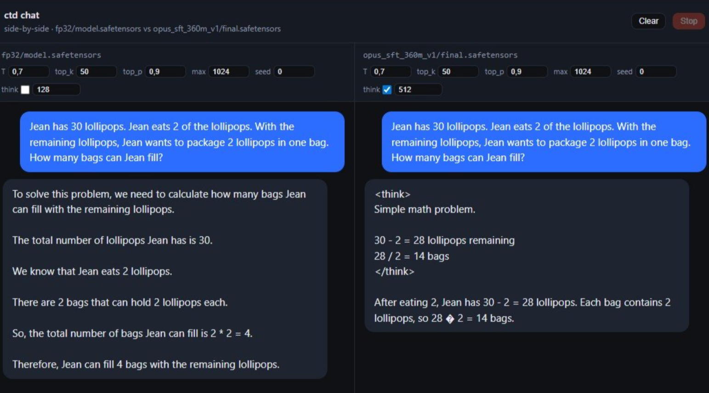
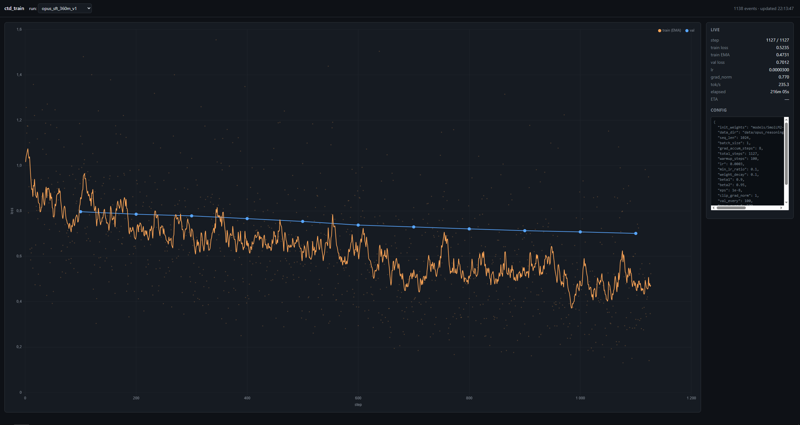

# emberlm

A from-scratch C++/CUDA framework for LLM inference and training. No PyTorch, no libtorch — just raw CUDA kernels, a minimal autograd engine, and enough infrastructure to fine-tune real models on a single consumer GPU.

Built and tested on an i5-14600KF / 32 GB RAM / RTX 5060 Ti 16 GB setup running Ubuntu 24.04 under WSL2.

## What's here

**Core engine** — a tensor library with automatic differentiation, CUDA kernels for every operation (matmul, softmax, RoPE, cross-entropy, RMSNorm, ...), and an AdamW optimizer with warmup + cosine LR scheduling.

**Multi-model support** — inference and training across three model families:

| Model | Parameters | Inference | Training | Notes |
|-------|-----------|-----------|----------|-------|
| SmolLM2-135M | 135M | yes | yes | Full GPU |
| SmolLM2-360M | 360M | yes | yes | Full GPU |
| Qwen3-0.6B | 751M | yes | yes | QK-Norm, native `<think>` |
| Qwen3-1.7B | 2.0B | yes | yes | Requires offload + checkpointing |
| LLaMA 3.2-1B | 1.24B | yes | yes | RoPE scaling, requires offload + checkpointing |

All models use the same C++ code path — architecture differences (GQA head counts, QK-Norm, RoPE scaling) are handled through config dispatch, not model-specific code.

**Memory optimization** — two features that enable training 1B+ models on 16 GB VRAM:
- Optimizer state offloading (AdamW m/v on CPU, per-parameter GPU swap during `step()`)
- Gradient checkpointing (recompute layer activations during backward instead of storing them)

**Reasoning SFT** — supervised fine-tuning that teaches models to reason step-by-step inside `<think>...</think>` blocks before answering. The training pipeline handles chat-template tokenization, per-token loss masking (train only on assistant turns), and thinking-budget forcing during inference.

**Web UI** — two lightweight FastAPI servers:
- Chat (port 8000): solo mode or side-by-side comparison of two models, with per-slot controls for temperature, top_k, top_p, seed, and thinking budget. Stop and clear buttons.
- Training monitor (port 8001): real-time loss curves via chart.js, run selector, hyperparameter display.





## Experiments

### Reasoning SFT on SmolLM2-360M

Fine-tuned SmolLM2-360M-Instruct for 1 epoch (~1127 steps, ~4 hours) on [claude-opus-4.6-10000x](https://huggingface.co/datasets/Roman1111111/claude-opus-4.6-10000x), a 9k-example reasoning dataset with chain-of-thought annotations. The model learned to emit `<think>...</think>` blocks with step-by-step reasoning before answering.

Evaluated on a 200-question subset of [GSM8K](https://huggingface.co/datasets/openai/gsm8k) (grade-school math):

| Model | GSM8K Accuracy | Mode |
|-------|---------------|------|
| SmolLM2-360M base | 17/200 (8.5%) | Greedy, no thinking |
| SmolLM2-360M SFT | 43/200 (21.5%) | T=0.6, thinking budget=1024 |

**2.5x improvement** from a single epoch of SFT. The SFT model produces correct `<think>` blocks in 100% of responses.

**Example** (SmolLM2-360M-SFT, GSM8K question about bridge weight limits):
```
<think>
The combined weight of the driver and truck is 3755 pounds.
The bridge capacity is 5000 pounds.
So the weight available for boxes is 5000 - 3755 = 1245 pounds.
The boxes weigh 15 pounds each, so the maximum number is 1245 / 15 = 83.
</think>

The maximum number of boxes is 83.
```

### Qwen3-0.6B (native reasoning)

Qwen3-0.6B already has built-in `<think>` capability. Our engine supports it out of the box — the thinking-budget mechanism works with both multi-token patterns (SmolLM2: 3 BPE tokens for `</think>`) and single special tokens (Qwen3: token 151668).

### LLaMA 3.2-1B

Inference verified correct (right answer on 23x47=1081 out of the box). Training works with optimizer offloading + gradient checkpointing on 16 GB VRAM.

## Building

Requirements: CUDA toolkit (12.x+), CMake 3.24+, a C++17 compiler, Python 3.10+ with `uv`.

```bash
cmake -S . -B build -DCMAKE_BUILD_TYPE=Release
cmake --build build -j

# Python dependencies (tokenizer, datasets, web server)
uv sync
source .venv/bin/activate
```

This produces three binaries in `build/bin/`:
- `ctd_tests` — 59 unit tests covering ops, autograd, and model forward/backward
- `ctd_generate` — inference CLI (reads JSON config from stdin, streams tokens to stdout)
- `ctd_train` — training CLI (reads config from a JSON file, writes checkpoints + loss.jsonl)

## Quick start

### 1. Fetch and convert weights

```bash
python scripts/fetch_model.py --model smollm2 --size 135M
python scripts/convert_weights.py SmolLM2-135M-Instruct

# Other models:
python scripts/fetch_model.py --model qwen3 --size 0.6B
python scripts/fetch_model.py --model llama --size 1B  # needs HF_TOKEN with gated repo access
```

### 2. Prepare training data

```bash
python scripts/prepare_data.py --model smollm2
python scripts/prepare_data.py --model qwen3
python scripts/prepare_data.py --model llama
```

### 3. Train

```bash
# Small model — fits entirely on GPU
./build/bin/ctd_train --config configs/smollm2_135m_sft.json

# Larger model — needs memory optimization
./build/bin/ctd_train --config configs/llama_1b_sft.json
```

Config fields for memory optimization:
```json
{
  "offload_optimizer": true,
  "gradient_checkpointing": true
}
```

Training writes to a run directory (derived from the config path):
- `loss.jsonl` — per-step metrics (loss, LR, grad norm, tokens/sec)
- `ckpt_step_N.safetensors` — model checkpoints
- `ckpt_step_N.safetensors.opt.safetensors` — optimizer state (for resume)
- `final.safetensors` — final weights

To resume from a checkpoint, add to your config:
```json
{
  "resume_from": "runs/my_run/ckpt_step_500.safetensors"
}
```

### 4. Chat

```bash
# Solo — one model
python scripts/serve_inference.py --solo models/SmolLM2-135M-Instruct/fp32/model.safetensors

# Side-by-side — compare base vs SFT
python scripts/serve_inference.py --sbs \
  models/SmolLM2-360M-Instruct/fp32/model.safetensors \
  runs/my_sft_run/final.safetensors
```

Open `http://localhost:8000`. Each slot has independent controls for temperature, top_k/top_p, seed, and thinking budget.

### 5. Monitor training

```bash
python scripts/serve_monitor.py  # port 8001
```

Open `http://localhost:8001` to see live loss curves.

### 6. Evaluate

```bash
python scripts/eval_gsm8k.py \
  --weights runs/my_sft_run/final.safetensors \
  --mode sft --n 200 --thinking-budget 1024
```

## Project structure

```
include/ctd/
  tensor.h          Tensor with shape, strides, storage, device
  autograd.h        Reverse-mode AD engine with checkpoint() support
  optim.h           AdamW with CPU offloading
  safetensors.h     Load/save weights (HuggingFace-compatible format)
  nn/
    model.h         LlamaConfig + Model struct, multi-arch autodetect
    attention.h     GQA with optional QK-Norm and RoPE scaling
    transformer_block.h
    ...
  ops/
    matmul.h        cuBLAS GEMM / batched GEMM
    rope.h          Rotary embeddings with LLaMA 3 frequency scaling
    loss.h          Cross-entropy with per-token loss masking
    norm.h          RMSNorm (forward + backward)
    softmax.h       Online softmax (forward + backward)
    ...

src/                CUDA kernel implementations
tools/
  ctd_generate/     Inference binary (autoregressive sampling)
  ctd_train/        Training binary (SFT with masked cross-entropy)
scripts/            Python helpers (data prep, serving, eval)
web/                Chat UI + training dashboard
configs/            Example training configs
```

## What's implemented from scratch

Every operation has a hand-written CUDA kernel with a corresponding backward pass:

- Tensor storage with reference-counted memory, contiguous + strided layouts
- Reverse-mode automatic differentiation (dynamic graph, topological-sort engine)
- Activation checkpointing (`autograd::checkpoint`) for memory-efficient training
- Matrix multiply via cuBLAS (forward) + custom backward kernels
- Fused softmax (online algorithm, numerically stable)
- Fused cross-entropy with per-token loss masking (SFT)
- RMSNorm with fused backward
- Rotary position embeddings (non-interleaved) with LLaMA 3 frequency scaling
- SiLU + elementwise ops
- GQA (grouped-query attention) with KV-cache for incremental decoding
- AdamW with decoupled weight decay, bias correction, per-group LR/WD
- Global gradient clipping (single-accumulator norm computation)
- Safetensors reader/writer (HuggingFace-compatible, zero-copy GPU upload)
- Top-k / top-p / temperature sampling

## Hardware

Developed and tested on:
- **CPU**: Intel i5-14600KF
- **RAM**: 32 GB DDR5
- **GPU**: NVIDIA RTX 5060 Ti 16 GB (Blackwell, sm_120)
- **OS**: Ubuntu 24.04 (WSL2)

Training throughput (fp32, B=1, seq_len=1024):

| Model | Step time | Tokens/sec | 1 epoch (~9k docs) |
|-------|-----------|------------|---------------------|
| SmolLM2-135M | ~7.6 s | ~140 | ~2.4 hours |
| SmolLM2-360M | ~12.6 s | ~80 | ~4 hours |
| Qwen3-0.6B | ~10 s | ~100 | ~6.4 hours |

## License

MIT
